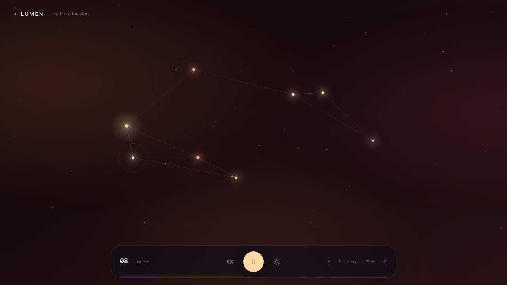

# LUMEN

**Make a tiny sky.** LUMEN is a zero-dependency constellation instrument: place lights in the dark, move them into a shape, and let the shape play itself.



## Open it

```sh
npm start
```

Then visit <http://127.0.0.1:4173>. The tiny included server lets the browser load JavaScript modules locally and adds a strict no-network content policy.

## Play it

- Click or tap empty space to place a light.
- Use the **+** button or press `L` to place a light without a pointer.
- Drag a light to reshape the constellation.
- Alt-click a light to remove it.
- Press Space to play/pause, `M` to mute, or `A` to change atmosphere.
- **Share sky** stores the whole constellation in the URL. Nothing is uploaded.

The current sky is saved to local browser storage. It has a deliberate 24-light limit, three musical atmospheres, deterministic background stars, and no runtime dependencies or tracking.

## Check it

```sh
npm test
```

The tests cover deterministic generation, immutable world edits, interaction geometry, edge generation, capacity limits, atmosphere cycling, and safe share-link round trips.
